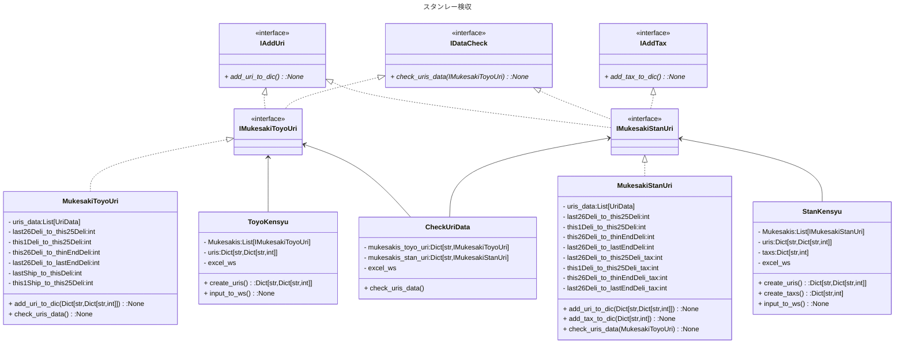

# Stanley Kensyu(スタンレー検収自動チェックプログラ厶)

```mermaid
---
title: スタンレー検収
---
classDiagram
direction TB


class IAddUri{
    <<interface>>
    + add_uri_to_dic():None*
}
class IAddTax{
    <<interface>>
    + add_tax_to_dic():None*
}
class IDataCheck{
    <<interface>>
    + check_uris_data(IMukesakiToyoUri):None*
}
class IMukesakiToyoUri{
    <<interface>>
}
class IMukesakiStanUri{
    <<interface>>
}
class MukesakiToyoUri{
    - uris_data:List[UriData]
    - last26Deli_to_this25Deli:int
    - this1Deli_to_this25Deli:int
    - this26Deli_to_thinEndDeli:int
    - last26Deli_to_lastEndDeli:int
    - lastShip_to_thisDeli:int
    - this1Ship_to_this25Deli:int
    + add_uri_to_dic(Dict[str,Dict[str,int]]):None
    + check_uris_data():None
}
class MukesakiStanUri{
    - uris_data:List[UriData]
    - last26Deli_to_this25Deli:int
    - this1Deli_to_this25Deli:int
    - this26Deli_to_thinEndDeli:int
    - last26Deli_to_lastEndDeli:int
    - last26Deli_to_this25Deli_tax:int
    - this1Deli_to_this25Deli_tax:int
    - this26Deli_to_thinEndDeli_tax:int
    - last26Deli_to_lastEndDeli_tax:int
    + add_uri_to_dic(Dict[str,Dict[str,int]]):None
    + add_tax_to_dic(Dict[str,int]):None
    + check_uris_data(MukesakiToyoUri):None
}
class ToyoKensyu{
    - Mukesakis:List[IMukesakiToyoUri]
    - uris:Dict[str,Dict[str,int]]
    - excel_ws
    + create_uris():Dict[str,Dict[str,int]]
    + input_to_ws():None
}
class StanKensyu{
    - Mukesakis:List[IMukesakiStanUri]
    - uris:Dict[str,Dict[str,int]]
    - taxs:Dict[str,int]
    - excel_ws
    + create_uris():Dict[str,Dict[str,int]]
    + create_taxs():Dict[str,int]
    + input_to_ws():None
}
class CheckUriData{
    - mukesakis_toyo_uri:Dict[str,IMukesakiToyoUri]
    - mukesakis_stan_uri:Dict[str,IMukesakiStanUri]
    - excel_ws
    + check_uris_data()
}


IAddUri <|.. IMukesakiToyoUri
IDataCheck <|.. IMukesakiToyoUri
IMukesakiToyoUri <|.. MukesakiToyoUri
IMukesakiToyoUri <-- ToyoKensyu
IMukesakiToyoUri <-- CheckUriData

IAddUri <|.. IMukesakiStanUri
IDataCheck <|.. IMukesakiStanUri
IMukesakiStanUri <|.. MukesakiStanUri
IMukesakiStanUri <-- StanKensyu
IMukesakiStanUri <-- CheckUriData
IAddTax <|.. IMukesakiStanUri
```

